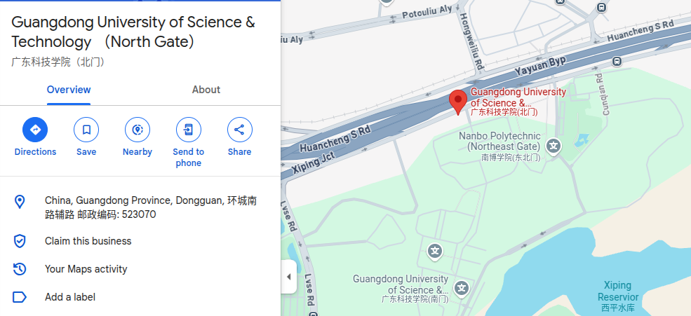

# 🌏🚀 跨境电商AI+ | CBEC AI+ Labs

**Bridging the Digital and Cross-Border E-Commerce with Open-Source AI Magic**  
*"We don't just predict trends – we create cross-border revolutions!"*

### 🧠 About Us: The Digital Caravanserai

Welcome to **CBEC AI+ Labs** - your next-gen AI pitstop for cross-border ecommerce innovation! Born at the intersection of ancient trade wisdom and modern machine learning, we're reimagining the "Belt and Road Initiative" and cross-border ecommerce for the ChatGPT era.

🔮 **Our Magic Formula**:  
`(<Belt and Road> × <Ecommerce>) <AIⁿ> + <☕️∞> = <Global Trade> 2.0`

### 📜 License
**Silk Road Public License** - Share knowledge like 8th-century merchants!

### 🚩 Proudly Sponsored By:
- The Ghost of Marco Polo's Curiosity ⚛️ 
- Unlimited Mongolian Milk Tea and coffee ☕️
- Your Future Billion-Dollar Idea 🌟

---

**开源 AI 驱动数字世界与跨境电商**

*"我们不只是预测趋势，我们创造跨境电商革命！"*

### 🧠 关于我们：丝路之歌新的商人

欢迎来到 **CBEC AI+ Labs** - 面向 ChatGPT 时代的跨境电商创新 AI 加油站！ 我们诞生于古老贸易智慧和现代机器学习的交汇点，为 ChatGPT 时代共创“一带一路”跨境电商的新机遇。

🔮 **我们的信条**：
`(<一带一路> × <跨境电商>) <AIⁿ> + <☕️∞> = <贸易革命> 2.0`

### 📜 许可证
**丝路之歌公共许可证** - 像来自第8世纪的商人一样分享知识！

### 🚩 项目荣誉赞助：
- 像前辈马可 · 波罗一般的好奇心 ⚛️
- 每一天的蒙古奶茶和咖啡 ☕️
- 你价值百万美元的创意和社区贡献 🌟

---
## 🔗 Let's Connect:

**广东科技学院大湾区产教融合研究院**：

地址：东莞市环城南路广东科技学院（北门）创业楼10楼1002室

电话：+86 15600907679

